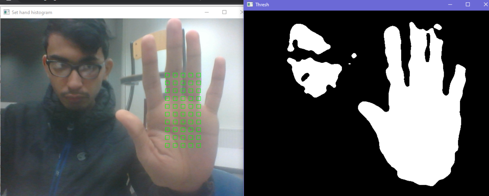
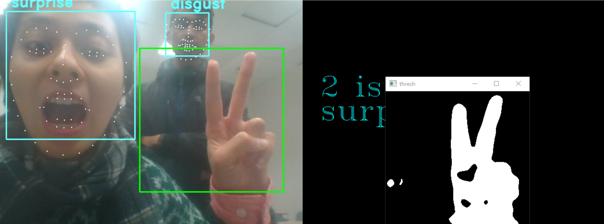

# Sign Language and Emotion Translator

- [Introduction](#Introduction)
- [Setup](#Setup)
- [An illustration](#Anillustration)

### Introduction

Sign language interpretation is an important piece of technology promoting accessibility for disabled individuals. Such tools have long been a way to offer deaf and hard of hearing people independence in their daily life. However, sign languages being natural and complete languages, they have their own rules of meta-communication. In "classic" languages, an important part of this meta-communication relies on intonation of the voice. Hence, a way around used by sign languages, and ASL in particular, is facial expressions. For example, English speakers may ask a question by raising the pitch of their voices and by adjusting word order; ASL users ask a question by raising their eyebrows, widening their eyes. Thus, emotion detection seemed a good first step to add such considerations to a simple sign language interpreter.
Therefore, in this project we aimed to combine two interpretation tools, emotion and sign language, as a first step to taking advantage of these two ways of communication at the same time.

### Setup

In order to set the histogram, run `set_hist`. Try to have your hand covering the green points. When you are satisfied with the result, push "c" on the keyboard. There would be a histogram appearing on the screen. Try to make the histogram as clear and precise as possible by modifying the light condition for example. When you are satisfied with the result, click "s" on the keyboard to save your histogram.

Now you can run the `main`. your camera would be open along with a blackboard on your screen. Give the  classifier a bit of time to recogonize your gestures and face emotion.

### An illustration

